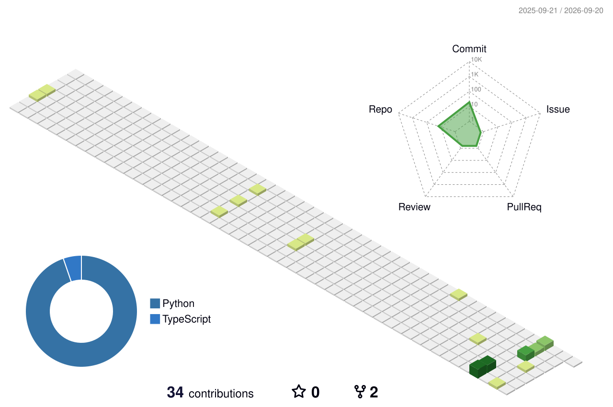

## Hi there 👋 I am Skull (Software Engineer - Security Enthusiast).

<!--
**5ku11Cru5h3r/5ku11Cru5h3r** is a ✨ _special_ ✨ repository because its `README.md` (this file) appears on your GitHub profile.
Here are some ideas to get you started:
-->
- 🔭 I’m currently working on Vexa AI (tts) and making a ui for it
- 🌱 I’m currently learning NextJS
- 👯 I’m looking to collaborate on Any frontend issues and 
- 🤔 I’m looking for help with Chef-Out-of-the-box
- 💬 Ask me about Anything Creative
- 📫 How to reach me: See my portfolio
- 😄 Pronouns: He/Him
- ⚡ Fun fact: Animation is possible in svg
---

<!---->

