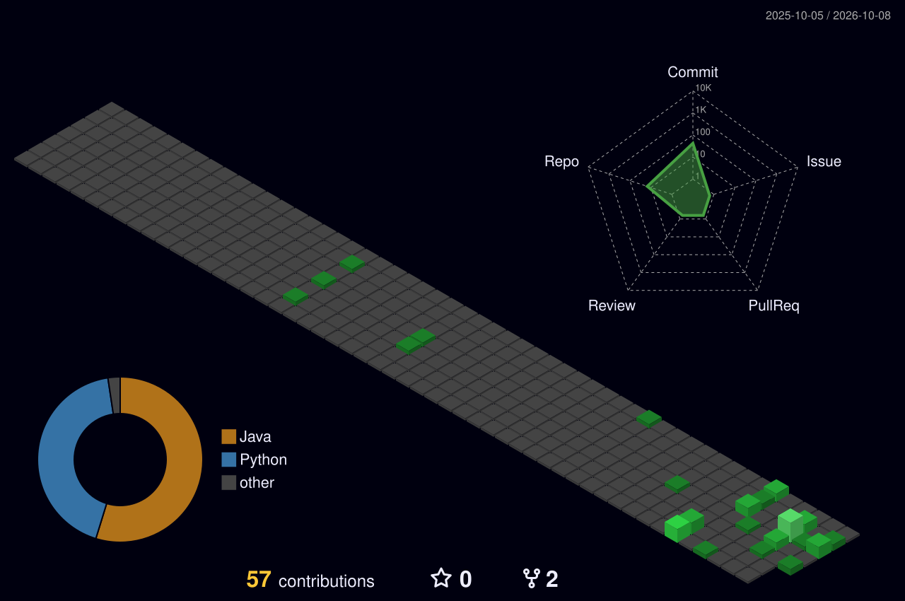

## Hi there 👋 I am Skull (Software Engineer - Security Enthusiast).

<!--
**5ku11Cru5h3r/5ku11Cru5h3r** is a ✨ _special_ ✨ repository because its `README.md` (this file) appears on your GitHub profile.
Here are some ideas to get you started:
-->
- Maths! Maths! Just Maths....Thats all I am doing now-a-days
---

<!---->

